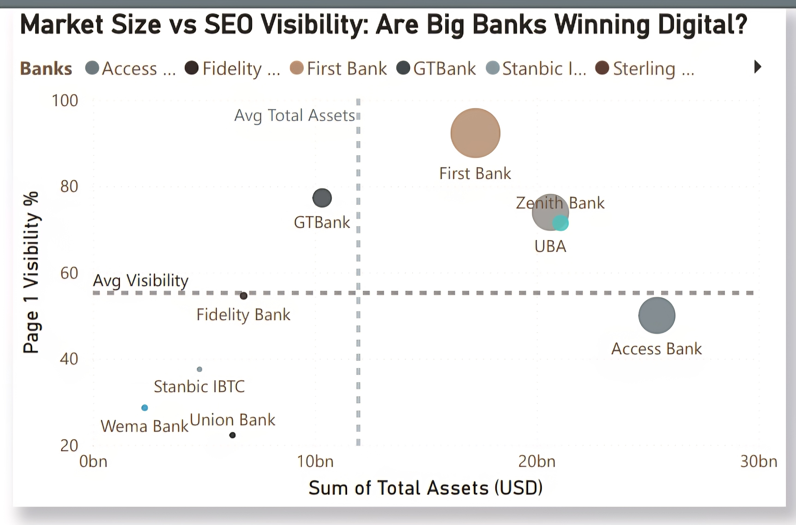
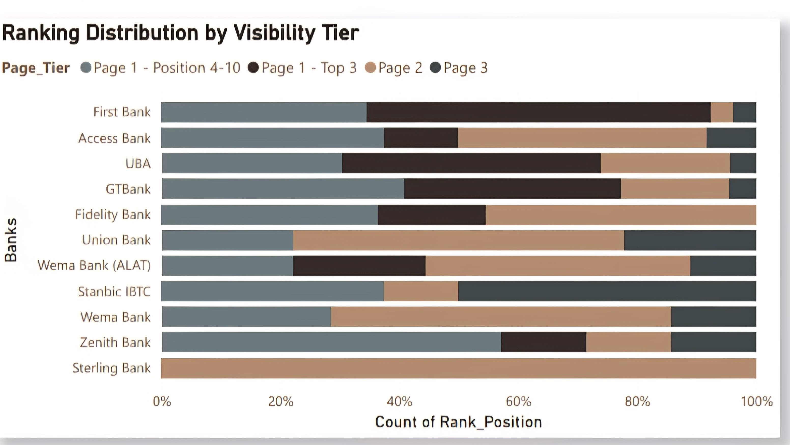
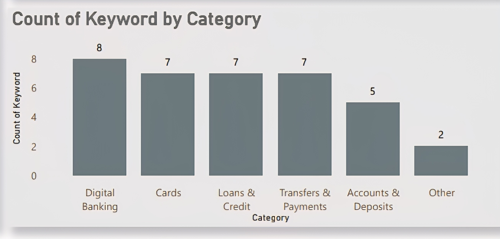

# Nigerian Banks SEO Analysis 🏦📊  
**Type:** Competitive Intelligence

## Overview  
This project evaluates the online visibility and search engine performance of selected Nigerian banks. It analyzes keyword competition, search demand, and SERP rankings to assess relative SEO strength and opportunity gaps.

**Banks covered:**  
Access Bank, Wema Bank (ALAT), Fidelity Bank, First Bank, GTBank, Union Bank, Sterling Bank, Zenith Bank, Stanbic IBTC.

---

## Problem Statement  
Nigerian banks compete aggressively for digital visibility, yet SEO performance varies widely. This analysis quantifies visibility quality, ranking depth, and missed keyword opportunities to identify which banks convert search demand into visibility most efficiently.

---

## Data Sources  
- **Keyword discovery:** Ubersuggest  
- **SERP rankings:** SerpAPI (queried via Python)  
- **Search volume:** Google Key Finder  
- **Click estimates:** Ubersuggest-derived CTR assumptions  
- **Financial data:** Nairametrics  

---

## Methodology  
1. Collected keyword-level SERP rankings and URLs per bank.  
2. Cleaned data by:
   - Removing duplicates  
   - Normalizing bank name variants  
   - Trimming whitespace  
   - Standardizing keyword categories  
3. Categorized keywords into:
   - Digital Banking  
   - Cards  
   - Loans & Credit  
   - Transfers & Payments  
   - Accounts & Deposits  
   - Other  
4. Engineered ranking tiers:
   - Page 1 (Top 3)  
   - Page 1 (Positions 4–10)  
   - Page 2  
   - Page 3  
5. Computed visibility and performance metrics (see Appendix).  
6. Final aggregation and visualization in Power BI.

**Note:** Some derived metrics used in Power BI are not included in the CSV export.

---

## Repository Structure

.
├── README.md
├── SEO_Dataset.csv
├── seo_dashboard.pdf
└── images/
    ├── dashboard1.jpg
    ├── dashboard2.jpg
    └── dashboard3.jpg

---

## Tools & Technologies  
- Python  
- Excel  
- SerpAPI  
- Power BI  

---

## Key Findings  
- **Coverage:** 36 tracked keywords; ~318K total monthly searches  
- **Opportunity gap:** ~16.5K unclaimed keyword searches  
- **Page 1 leader:** First Bank (24 Page 1 keywords; 92.31% visibility quality)  
- **Quality vs quantity:**  
  - First Bank: high quantity, high quality  
  - GTBank, Zenith: high quality, concentrated rankings  
  - Access Bank: high quantity, lower quality  
- **SEO efficiency:**  
  - Top: First Bank, GTBank, UBA, Zenith  
  - Lower performers: Wema Bank, Union Bank, Stanbic IBTC  
- **Business signal:** Higher SEO visibility aligns with higher profitability (correlation, not causation).

---
## Visual Outputs

**Interactive Dashboard (PDF)**  
[View SEO Dashboard](seo_dashboard.pdf)

**Dashboard Previews (click to enlarge)**  

  
  

---
## Data Access

**Engineered Dataset (CSV)**  
[Download SEO_Dataset.csv](SEO_Dataset.csv)
---

## Metric Definitions (Appendix)

### 1. Ranking Tier Weights  
To reflect the unequal value of SERP positions, rankings were grouped and weighted as follows:

- **Page 1 (Top 3):** Weight = 1.00  
- **Page 1 (Positions 4–10):** Weight = 0.70  
- **Page 2:** Weight = 0.30  
- **Page 3:** Weight = 0.10  

---

### 2. Visibility Quality (%)  
Measures how strong a bank’s rankings are, not just how many keywords it ranks for.

**Formula:**
Visibility Quality (%) = ( Σ Weighted Keyword Positions ÷ Total Keywords Tracked ) × 100

Higher values indicate stronger concentration in top SERP positions.

---

### 3. Visibility Share  
Represents a bank’s proportion of total SEO visibility across all tracked keywords.

**Formula:**
Visibility Share = Bank Visibility Score ÷ Total Visibility Score (All Banks)

---

### 4. Estimated Monthly Clicks  
Approximates organic traffic captured from search demand.

**Formula:**
Estimated Monthly Clicks = Visibility Share × Monthly Search Volume

CTR effects are embedded in ranking-tier weights rather than modeled separately.

---

### 5. SEO Efficiency Score  
Evaluates how effectively a bank converts keyword coverage into high-quality visibility.

**Conceptual Definition:**

SEO Efficiency ∝ Visibility Quality ÷ Keyword Quantity

Banks with fewer keywords but stronger Page 1 dominance score higher than banks with broad but shallow coverage.

---

### Interpretation Notes  
- Metrics prioritize **quality over volume**.  
- Results reflect **competitive SEO positioning**, not guaranteed traffic or revenue.  
- Financial comparisons are **associative**, not causal.

